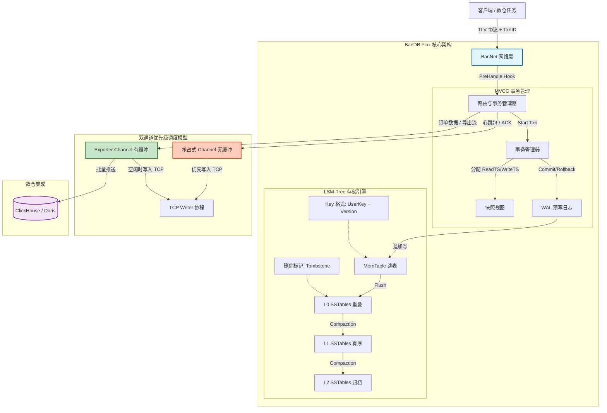

# BanDB "Flux" - 基于自研架构的高性能数仓前置存储

> **BanDB Flux** is a high-performance Key-Value store built on a **fully self-developed TCP framework**. Designed as the ideal pre-storage layer for Data Warehouses, it features network-level programmable hooks for real-time data processing and leverages an LSM-Tree engine for massive log ingestion.

---

## 🚀 1. 核心功能 (Features)

### 🛠️ 全自研技术栈 (Self-Developed Stack)
*   **自研 TCP 框架 (BanNet)**：摒弃沉重的 HTTP/gRPC，采用轻量级 TLV 二进制协议。支持连接级 Hook（Pre/Post Handle），可在网络层直接实现数据清洗、格式校验与动态限流。
*   **LSM-Tree 存储引擎**：专为写密集型场景设计。通过跳表（SkipList）实现内存高速写入，配合后台异步 Compaction 机制，确保持久化过程不阻塞主线程。
*   **双通道优先级调度**：独创抢占式 Channel 设计，将在线实时响应与批量数据导出（如数仓同步）隔离，确保在高吞吐导出时业务延迟依然稳定。

### 🌊 数仓前置处理场景
*   **电商订单流水**：应对大促期间每秒数万笔的订单创建高峰，利用 LSM 的顺序写特性实现高吞吐入库，并通过网络 Hook 实时计算订单金额或拦截异常交易。
*   **用户行为追踪**：存储海量的用户点击流（Clickstream），以 `UserID + Timestamp` 为 Key，支持快速回放用户路径并同步到 OLAP 引擎进行转化分析。
*   **网络层 ETL**：通过 `PreHandle` 钩子在数据落盘前完成脱敏、格式标准化或无效数据过滤，减轻下游数仓（ClickHouse/Doris）的计算压力。
*   **流式数据导出**：支持低优先级通道流式推送全量数据，实现与离线数仓的无缝对接。

---

## 💎 2. 核心优势 (Advantages)

| 维度 | BanDB Flux | 传统方案 (Redis/MySQL) |
| :--- | :--- | :--- |
| **架构自主性** | ✅ **100% 自研网络与存储** | ❌ 依赖第三方库，黑盒难调优 |
| **网络层可编程** | ✅ **Hook 机制实时干预** | ❌ 需额外部署 Nginx/网关 |
| **写入吞吐量** | ⭐⭐⭐⭐⭐ (LSM 顺序写) | ⭐⭐ (B+树随机 I/O 瓶颈) |
| **数仓集成度** | ✅ **原生支持流式导出** | ⚠️ 需开发复杂的 CDC 同步工具 |
| **资源利用率** | ✅ **零外部依赖，极致轻量** | ❌ 运行时依赖多，内存开销大 |

### 🎯 为什么选择 BanDB Flux？
1.  **深度可控**：从 TCP 握手到磁盘 SSTable 生成，每一行代码都可追溯、可定制。适合对性能和安全性有极高要求的场景。
2.  **削峰填谷**：作为数仓的"缓冲带"，利用 MemTable 吸收突发流量，保护后端 OLAP 系统不被瞬时高峰打垮。
3.  **极简运维**：单二进制文件启动，无复杂的环境依赖，非常适合嵌入式部署或边缘计算节点。

---

## 🏗️ 3. 系统架构

### 架构演进：MVCC 与双通道调度

BanDB Flux 计划引入 MVCC（多版本并发控制）以支持数仓 T+0 一致性快照读取，并通过独创的双通道模型实现流量隔离。



### 💡 设计亮点
*   **抢占式心跳**：无缓冲通道确保心跳包在任何情况下都能"插队"发送，维持连接稳定性。
*   **Exporter 缓冲区**：有缓冲通道承载数仓同步的大流量，通过背压机制保护内存不被撑爆。
*   **MVCC 快照读**：数仓任务基于 `ReadTS` 获取一致性视图，读写互不阻塞。

---

## 🛠️ 4. 如何启动 (Getting Started)

### 环境要求
*   Go 1.26+
*   Windows / Linux / macOS

### 快速启动

1.  **克隆项目**
    ```bash
    git clone https://github.com/NeverENG/bandb.git
    cd BanDB
    ```

2.  **配置运行参数**
    修改 `config/config.json`，根据你的硬件调整内存表大小。
    ```json
    {
      "max_mem_table_size": 10000,
      "worker_pool_size": 4,
      "max_msg_chan_len": 1024
    }
    ```

3.  **运行服务**
    ```bash
    cd Server
    go run .
    ```

4.  **交互式客户端测试**
    ```bash
    cd client
    go run . localhost:8080
    ```
    *   **写入日志**：`put 20260508120000 {"level": "INFO", "msg": "service started"}`
    *   **读取日志**：`get 20260508120000`

---

## 💡 典型场景分析：电商订单与实时数仓

在复杂的业务架构中，BanDB Flux 充当**高性能数据接入层**的角色：

1.  **订单接收阶段**：客户端通过自研 TLV 协议发送订单信息，`PreHandle` 钩子自动校验订单格式并拦截恶意刷单请求。
2.  **高速存储阶段**：合法订单被追加到跳表（MemTable），实现微秒级写入响应，完美扛住"双11"级别的流量洪峰。
3.  **持久化与合并**：当内存达到阈值，后台协程自动将其 Flush 为有序的 SSTable 文件，并按时间维度进行 Compaction。
4.  **数仓同步阶段**：数仓任务触发时，通过低优先级通道批量拉取历史订单数据，实现 T+0 的实时数据分析。

```go
// 示例：在网络层实现订单金额预校验
router.SetPreHandle(func(req banIface.IRequest) {
    order := parseOrder(req.GetMsgData())
    if order.Amount <= 0 {
        return // 直接丢弃金额 <= 0 的异常订单
    }
})
```

## 📚 5. 详细设计文档

详细设计文档请查看 [BanDB Flux 详细设计文档](https://github.com/NeverENG/bandb/blob/main/docs/BanDB%20Flux%20Design%20Document.md)。
