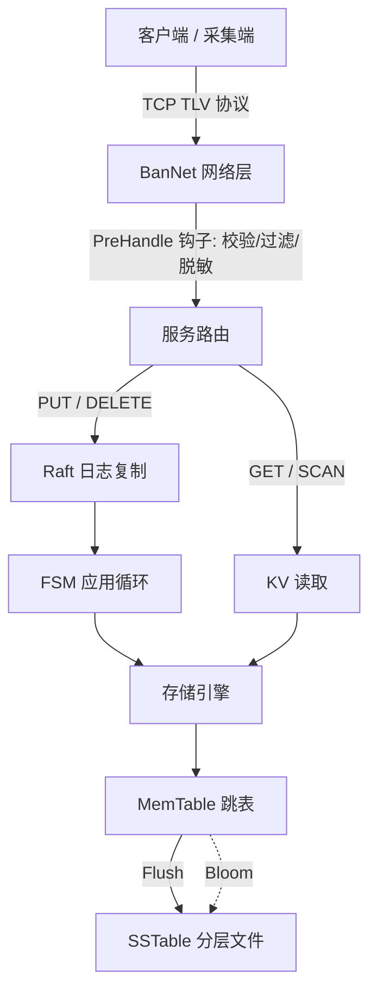

# BanDB Flux —— 具身智能 / AIoT 高性能边缘采集数据引擎

BanDB Flux 是一个用 Go 从零实现的高性能 Key-Value 数据引擎，自带**自研 TCP 框架**、**LSM 存储引擎**与**基于 Raft 的写复制**，面向**具身智能 / AIoT 的边缘高频多模态采集**而生。

它坐在传感器采集入口，做成熟栈（ROS2/DDS、rosbag2/MCAP、Zenoh）通常不做的一件事——**在数据落盘前做可编程预处理，并在边缘侧查询、只回传命中的关键切片**。

> **定位红线**：BanDB **不替代**机器人中间件，是它们之外的「采集入口可编程层」。"单二进制 / 低内存"是边缘赛道的入场券，不当作护城河来吹。

---

## 它解决什么

边缘设备（机器人机载电脑、车载、采集终端）在高频采集相机帧、IMU 等多模态数据时，硬件资源受限、网络弱而不稳。BanDB Flux 的角色是：

1. **本地优先高频落盘**：传感器只管写，LSM 引擎用内存跳表吸收瞬时高频写入，后台异步 Compaction 顺序落盘。
2. **落盘前可编程预处理**：通过 `PreHandle` 钩子在网络层、数据进系统的那一刻做校验/裁剪/脱敏/丢弃畸形帧。
3. **边缘查询 + 切片上传**（建设中）：本地按时间范围 + 谓词定位"黄金切片"，只回传命中数据，而非整段原始流。

---

## 核心能力（已实现）

- **自研 TCP 框架 BanNet**：连接管理、worker pool、消息打解包与生命周期钩子，核心 KV 路径不依赖 HTTP/gRPC。
- **二进制 TLV 协议**：紧凑的定长帧头 + msgID + 二进制负载。
- **可编程钩子**：路由支持 `PreHandle` / `PostHandle` 回调，可用于校验、过滤、轻量 ETL。
- **LSM 存储路径**：写入进入 MemTable（跳表），经 Bloom 过滤器加速查询，分层 Compaction 顺序落盘成 SSTable。
- **Raft 写复制**：写命令经 Raft 日志复制后再应用到存储引擎；WAL 采用 **group-commit**，把整批写的 N 次 fsync 摊销为 1 次。崩溃恢复（重启重放日志）与快照均由 Raft 层负责。
- **交互式客户端**：类 Redis-CLI 的交互模式与一次性命令模式。

---

## 架构



- **客户端层**：构造二进制 KV 负载，经 TCP 发送。
- **BanNet 网络层**：收连接、解帧、跑钩子、派发路由、写回响应。
- **服务层**：消息 ID → KV 操作，协调 Raft 写提交。
- **存储层**：把已提交命令应用到 MemTable / SSTable。耐久性由 Raft WAL 提供（存储层自身无 WAL）。

---

## 快速启动

环境：Go 1.26+，Windows / Linux / macOS。

```powershell
# 启动服务（默认读 config/config.json，监听 127.0.0.1:8080）
cd Server
go run .

# 另开终端启动客户端
cd client
go run .
```

交互示例：

```text
> put imu:dev0:20260606120000 {"ax":0.01,"ay":9.8,"az":0.02}
OK
> get imu:dev0:20260606120000
"{...}"
> quit
```

---

## 协议

定长帧头的二进制协议：

```text
[dataLen: uint32] [msgID: uint32] [payload]
```

| msgID | 操作 | 负载 |
| --- | --- | --- |
| `1` | PUT | `keyLen:uint32 + valueLen:uint32 + key + value` |
| `2` | GET | `keyLen:uint32 + key` |
| `3` | DELETE | `keyLen:uint32 + key` |

响应负载首字节为状态标志（`0x00` 成功 / `0x01` 失败）；GET 成功时其后接 `valueLen:uint32 + value`。

---

## 压测

`benchmark/ingest/` 提供面向高频摄入的开环压测（饱和相找吞吐天花板 + 定速率相证丢帧/尾延迟/内存）。真实数据与诚实结论见 [`docs-step/M1-ingest-benchmark-result.md`](docs-step/M1-ingest-benchmark-result.md)。

```powershell
go run ./benchmark/ingest/ -sat 0 -d 60s -rates 50000,100000,200000
```

---

## 路线图

**进行中 / 计划**：
- 写路径**背压**：未刷盘积压超硬上限时阻塞写入，使内存在持续负载下真正有界。
- **边缘查询**：`scan(start_ts, end_ts) + 谓词` 范围扫描，只打包命中切片上传。
- 落盘前**真实过滤钩子**示例（丢超时/畸形帧、字段脱敏、时间戳单调校验）。
- 固定多节点边缘网关模式下，用 Raft 复制采集清单 / 断点等协调元数据。

**明确不做**（避免过度承诺）：移动设备间 Multi-Raft 强一致互备、去中心化共识调度、传感器时间同步、把对象存储已有的断点续传 + hash 校验当作自研创新。
