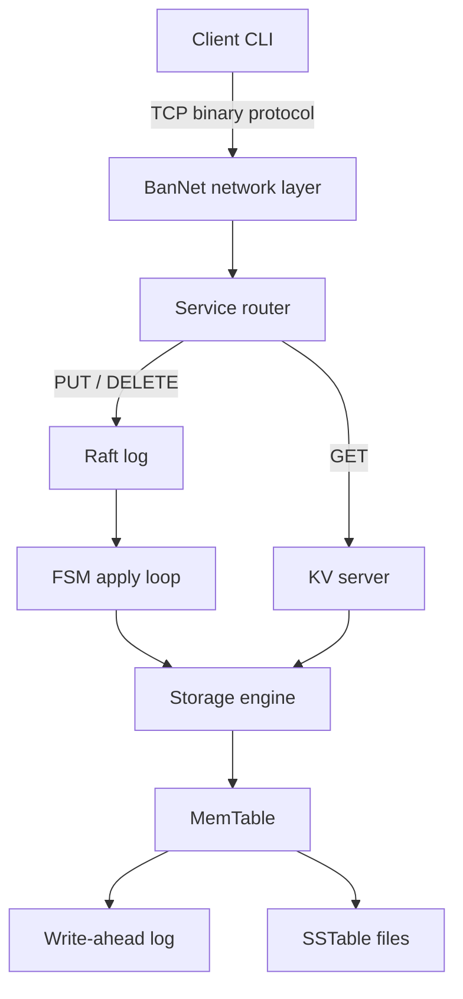

# BanDB Flux

BanDB Flux is a high-performance key-value database written in Go. It combines a self-developed TCP networking layer, an LSM-style storage engine, and Raft-backed write replication for a lightweight distributed KV service.

The project is designed as a programmable ingestion and pre-storage layer for write-heavy systems, such as log collection, clickstream capture, order/event buffering, and real-time data pipelines.

## Documentation Index

- [Original README / Chinese draft](README.zh-CN.md)
- [Architecture diagram](architecture-diagram.md)
- [Client guide](client/README.md)
- [Storage optimization notes](%E8%BF%AD%E4%BB%A3%E6%96%B9%E6%A1%88/storage-bottleneck-optimization.md)

## Table of Contents

- [Features](#features)
- [Architecture](#architecture)
- [Project Layout](#project-layout)
- [Getting Started](#getting-started)
- [Client Usage](#client-usage)
- [Protocol](#protocol)
- [Configuration](#configuration)
- [Testing](#testing)
- [Use Cases](#use-cases)
- [Roadmap](#roadmap)

## Features

- **Self-developed TCP framework**: BanNet implements the server, connection management, request routing, message packing, and lifecycle hooks without depending on HTTP or gRPC for the core KV path.
- **Binary TLV protocol**: requests use compact framed messages with a message ID and binary payload.
- **KV command support**: the service currently exposes `put`, `get`, and `delete` through the TCP client.
- **Programmable hooks**: routers support pre-handle and post-handle callbacks, which can be used for validation, filtering, lightweight ETL, or request instrumentation.
- **LSM-style storage path**: writes enter a MemTable, are protected by WAL, and can be flushed into SSTable files.
- **Raft integration**: mutating commands are appended through the Raft path before being applied to the storage engine.
- **Snapshot support**: Raft state includes snapshot-related persistence and recovery paths.
- **Interactive client**: the `client` package provides a Redis-CLI-like interactive mode and a one-shot command mode.

## Architecture

At a high level, BanDB Flux is split into four layers:

1. **Client layer**: builds binary KV payloads and sends them over TCP.
2. **BanNet network layer**: accepts connections, unpacks messages, dispatches requests to routers, and writes buffered responses.
3. **Service layer**: maps message IDs to KV operations and coordinates Raft-backed command submission.
4. **Storage layer**: applies committed commands to the MemTable/WAL/SSTable storage engine.



## Project Layout

```text
.
├── Server/             # TCP KV server entry point and runtime scripts
├── client/             # Interactive and command-line TCP client
├── config/             # Runtime configuration
├── network/            # BanNet TCP framework and interfaces
├── service/            # KV router, FSM, and HA/Raft coordination
├── storage/            # Storage engine, MemTable, WAL, and SSTable code
├── Raft/               # Raft implementation, persistence, snapshots, and tests
├── benchmark/          # TCP benchmark helpers
├── grpc_benchmark/     # gRPC benchmark helpers
├── server_grpc/        # Experimental gRPC server entry point
└── test_grpc/          # gRPC protocol and test client/server code
```

## Getting Started

### Requirements

- Go `1.26.1` or the version declared in [go.mod](go.mod)
- Windows, Linux, or macOS

### Start the TCP Server

From the repository root:

```powershell
cd Server
go run .
```

By default, the server reads [config/config.json](config/config.json) and listens on `127.0.0.1:8080`.

### Start the Client

Open another terminal from the repository root:

```powershell
cd client
go run .
```

Then run commands interactively:

```text
> put name Alice
OK
> get name
"Alice"
> delete name
OK
> quit
```

Command mode is also available:

```powershell
cd client
go run . put name Alice
go run . get name
go run . delete name
```

## Client Usage

Supported commands:

| Command | Description | Example |
| --- | --- | --- |
| `put <key> <value>` | Store or overwrite a key-value pair | `put name Alice` |
| `get <key>` | Read a value by key | `get name` |
| `delete <key>` | Delete a key | `delete name` |
| `help` | Show interactive help | `help` |
| `quit` / `exit` | Exit interactive mode | `quit` |

Interactive mode keeps one TCP connection open and supports values that contain spaces.

## Protocol

BanDB uses a framed binary protocol.

Request frame:

```text
[dataLen: uint32] [msgID: uint32] [payload]
```

Message IDs:

| ID | Operation | Payload |
| --- | --- | --- |
| `1` | PUT | `keyLen:uint32 + valueLen:uint32 + key + value` |
| `2` | GET | `keyLen:uint32 + key` |
| `3` | DELETE | `keyLen:uint32 + key` |

Response payloads use a one-byte status flag where `0x00` means success and `0x01` means error. Successful GET responses include `valueLen:uint32 + value` after the status byte.

## Configuration

The default configuration lives in [config/config.json](config/config.json):

```json
{
  "MaxMemTableSize": 10000,
  "WALPath": "../../log/wal.log",
  "SSTablePath": "../../log",
  "Host": "127.0.0.1",
  "Port": 8080,
  "MaxConn": 100,
  "WorkPoolSize": 100,
  "MaxMsgChanLen": 100,
  "MaxCompactionSize": 4,
  "RaftSnapshotThreshold": 1000
}
```

Tune these values for memory pressure, worker concurrency, connection limits, storage paths, and Raft snapshot behavior.

## Testing

Run all Go tests from the repository root:

```powershell
go test ./...
```

Run focused suites:

```powershell
go test ./storage/...
go test ./service/...
go test ./Raft -v
```

On Windows, Raft helper scripts are also available:

```powershell
cd Raft
.\quick-test.bat
.\run-tests.bat
```

## Use Cases

### High-Frequency Log Ingestion

BanDB Flux is a good fit for services that continuously generate large volumes of logs, metrics, or trace-like events. Instead of writing every event directly into a heavier downstream system, applications can write compact key-value records into BanDB first.

For example, a service can use a timestamp-based key and store the raw log payload as the value:

```text
put log:20260517:service-a:000001 {"level":"INFO","msg":"request accepted","trace_id":"abc"}
put log:20260517:service-a:000002 {"level":"ERROR","msg":"timeout","trace_id":"def"}
```

This pattern works well because writes first land in memory through the MemTable and are protected by WAL, while the LSM-style storage path is optimized for sequential write-heavy workloads. The TCP protocol also avoids HTTP overhead on the hot path, making it suitable for high-throughput ingestion agents.

Typical flow:

1. Application or log agent sends log records over the BanDB TCP protocol.
2. BanNet routes the request and optionally runs validation or filtering hooks.
3. The write is appended through Raft and applied to the storage engine.
4. Downstream analytics systems can later consume, replay, or export the stored logs.

### Other Scenarios

- **Write-heavy event buffering**: absorb bursty order, log, or tracking events before downstream analytics systems consume them.
- **Pre-storage for data warehouses**: keep ingestion lightweight while exporting or replaying data into OLAP systems.
- **Network-layer ETL**: use routing hooks to validate, normalize, filter, or reject data before it reaches storage.
- **Embedded KV service**: run as a compact TCP service with minimal runtime dependencies.

## Roadmap

- Broaden multi-node Raft deployment tooling.
- Add clearer operational scripts for Linux/macOS.
- Improve SSTable compaction controls and observability.
- Add protocol compatibility tests for clients.
- Expand English documentation for design decisions and benchmark results.
